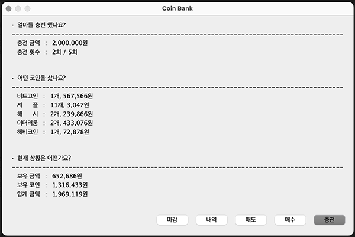

### Coinbank: 모의 가상화폐 거래소

[프로젝트 회고록](https://jisulog.com/docs/essay/project-review/2019-coinbank)

## 개요
실시간 가격 변동을 가상으로 체험하며 암호화폐 투자에 대한 이해를 높이는 서비스입니다.
사용자는 자신의 투자 전략을 시험하고, 결과 분석 리포트를 통해 성과를 점검할 수 있습니다.
이 서비스를 이용해 실제 시장의 리스크 없이 투자 능력을 시험해 볼 수 있습니다.

## 설치 및 실행 방법
> 프로젝트를 IDE에 불러와 컴파일 후 실행할 수 있습니다.

## 주요 기능
- 시작 금액을 통해 난이도를 설정할 수 있습니다.
- 각 거래가 진행될 때, 전체 코인의 가격이 변동됩니다.
- 현재 상황과 거래 내역을 확인할 수 있습니다.
- 마감 시에 성과에 대한 리포트가 제공됩니다.

## 기술 스택
- **언어**
  - Java
- **라이브러리**
  - Swing
- **IDE**
  - Eclipse

## 라이선스
Copyright © 2019. [EGO CREW](https://ego.so/). All rights reserved.